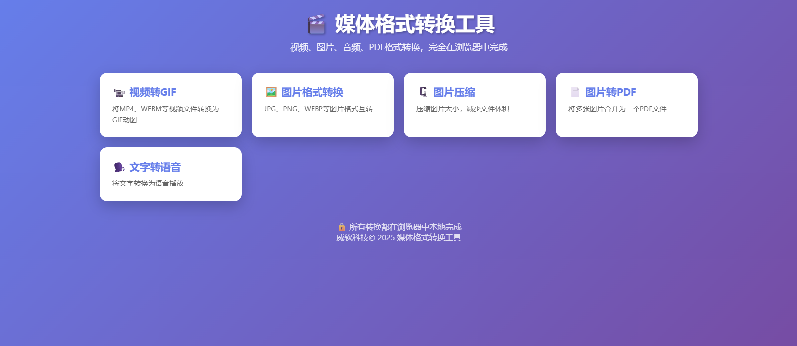
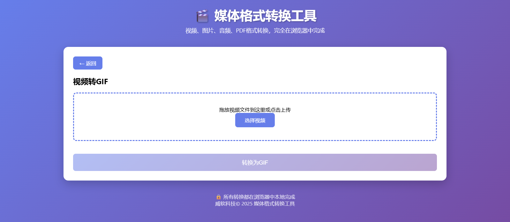
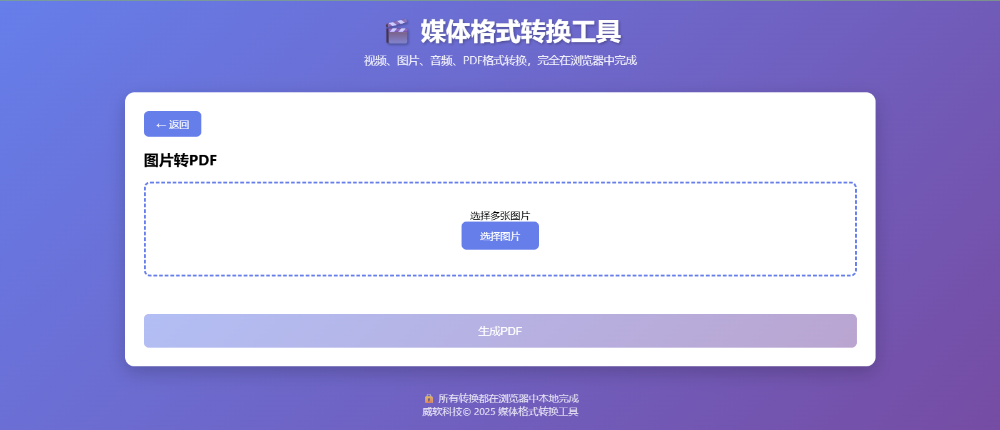
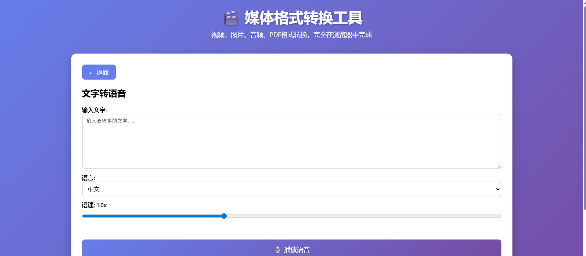

# 威软Toolbox 🎬

一个强大的在线媒体格式转换工具，完全在浏览器中运行，无需上传文件到服务器，保护您的隐私安全。


## 📸 预览截图

### 主界面

*简洁美观的主界面，8个实用工具一目了然*

### 视频转GIF

*支持自定义帧率、分辨率，实时显示转换进度*

### 图片格式转换

*支持PNG、JPEG、WEBP格式互转，可调节质量*

### 图片压缩

*智能压缩，显示压缩前后对比*

### 图片转PDF

*批量上传图片，一键生成PDF文档*

### 文字转语音

*多语言支持，可调节语速*

## ✨ 功能特性

### 🎥 视频处理
- **视频转GIF** - 将MP4、WEBM等视频文件转换为GIF动图
  - 自定义起始时间和持续时间
  - 可调节帧率（5-15 fps）
  - 自定义输出宽度（200-800px）
  - 实时进度显示

### 🖼️ 图片处理
- **图片格式转换** - JPG、PNG、WEBP等格式互转
  - 支持质量调节（1-100%）
  - 保持原始图片质量
  
- **图片压缩** - 减小图片文件大小
  - 可调节压缩质量
  - 自定义最大宽度
  - 显示压缩比例和文件大小对比

### 📄 文档处理
- **图片转PDF** - 将多张图片合并为一个PDF文件
  - 支持批量添加图片
  - 可自由调整图片顺序
  - 支持竖向/横向布局

### 🗣️ 语音处理
- **文字转语音** - 使用浏览器内置TTS引擎
  - 支持多种语言（中文、英语、日语、韩语等）
  - 可调节语速（0.5x - 2x）
  - 实时播放预览

## 🚀 快速开始

### 在线使用
直接访问部署好的网站即可使用，无需安装任何软件。

### 本地部署

1. **克隆仓库**
```bash
git clone https://github.com/your-username/weiruan-toolbox.git
cd weiruan-toolbox
```

2. **直接打开**
```bash
# 使用任何现代浏览器打开 index.html
open index.html  # macOS
start index.html # Windows
xdg-open index.html # Linux
```

### GitHub Pages 部署

1. Fork 本仓库到你的 GitHub 账号
2. 进入仓库设置 (Settings)
3. 找到 Pages 选项
4. Source 选择 `main` 分支
5. 点击 Save
6. 访问 `https://your-username.github.io/weiruan-toolbox`

## 📦 技术栈

- **纯HTML + CSS + JavaScript** - 无需任何构建工具
- **第三方库**：
  - [gifshot](https://github.com/yahoo/gifshot) - GIF 生成
  - [jsPDF](https://github.com/parallax/jsPDF) - PDF 生成
- **Web APIs**：
  - Canvas API - 图片处理
  - Web Speech API - 文字转语音
  - File API - 文件读取

## 📁 项目结构

```
weiruan-toolbox/
├── index.html          # 主页面文件
├── README.md           # 项目说明文档
├── LICENSE            # 开源协议
└── screenshots/       # 截图文件夹
    ├── home.png
    ├── video-to-gif.png
    ├── image-convert.png
    ├── image-compress.png
    ├── images-to-pdf.png
    └── text-to-speech.png
```

## 💡 使用说明

### 视频转GIF
1. 点击"视频转GIF"卡片
2. 选择或拖放视频文件
3. 设置起始时间、持续时间、帧率和宽度
4. 点击"转换为GIF"
5. 等待处理完成后下载

**建议参数：**
- 持续时间：1-5秒
- 帧率：10 fps（流畅与文件大小的平衡）
- 宽度：480px（适合大多数用途）

### 图片格式转换
1. 点击"图片格式转换"卡片
2. 上传图片
3. 选择目标格式（PNG/JPEG/WEBP）
4. 调整质量（仅JPEG/WEBP）
5. 点击"转换图片"并下载

### 图片压缩
1. 点击"图片压缩"卡片
2. 上传需要压缩的图片
3. 调整压缩质量和最大宽度
4. 点击"压缩图片"
5. 查看压缩效果和下载

### 图片转PDF
1. 点击"图片转PDF"卡片
2. 选择多张图片（支持批量上传）
3. 可以删除不需要的图片
4. 点击"生成PDF"并下载

### 文字转语音
1. 点击"文字转语音"卡片
2. 输入要转换的文字
3. 选择语言和调整语速
4. 点击"播放语音"试听
5. 可以随时点击"停止"按钮

## 🔒 隐私保护

- ✅ **完全本地处理** - 所有转换都在浏览器中完成
- ✅ **零服务器上传** - 文件不会离开您的设备
- ✅ **无数据收集** - 不记录任何用户信息
- ✅ **开源透明** - 代码完全开源，可审查

## 🌐 浏览器兼容性

| 浏览器 | 支持版本 |
|--------|---------|
| Chrome | ✅ 90+ |
| Firefox | ✅ 88+ |
| Safari | ✅ 14+ |
| Edge | ✅ 90+ |
| Opera | ✅ 76+ |

**注意：** 不同浏览器的文字转语音效果可能有差异。

## ⚠️ 注意事项

1. **视频转GIF**：
   - 建议持续时间不超过10秒
   - 帧率越高，文件越大
   - 降低分辨率可以减小文件大小

2. **图片压缩**：
   - 压缩是有损的，会降低图片质量
   - 建议保留原始文件备份

3. **文字转语音**：
   - 使用浏览器内置引擎，音质因浏览器而异
   - 某些语言可能需要系统支持

## 🛠️ 常见问题

### Q: 为什么视频转GIF卡在100%？
A: 可能是视频时间过长或帧率过高，建议：
- 减少持续时间到3秒以内
- 降低帧率到10或更低
- 降低输出宽度到480px

### Q: 支持哪些视频格式？
A: 支持浏览器能播放的所有格式，通常包括MP4、WEBM、OGG等。

### Q: 图片转PDF有大小限制吗？
A: 没有硬性限制，但图片过大或过多可能导致浏览器卡顿。

### Q: 可以离线使用吗？
A: 首次加载后，大部分功能可以离线使用，但需要提前加载外部库。

## 📝 更新日志

### v1.0.0 (2025-12-15)
- ✨ 初始版本发布
- 🎥 视频转GIF功能
- 🖼️ 图片格式转换功能
- 🗜️ 图片压缩功能
- 📄 图片转PDF功能
- 🗣️ 文字转语音功能

## 🤝 贡献

欢迎提交 Issue 和 Pull Request！

1. Fork 本仓库
2. 创建特性分支 (`git checkout -b feature/AmazingFeature`)
3. 提交更改 (`git commit -m 'Add some AmazingFeature'`)
4. 推送到分支 (`git push origin feature/AmazingFeature`)
5. 开启 Pull Request

## 📄 开源协议

本项目采用 MIT 协议开源。

```
MIT License

Copyright (c) 2025 威软科技

Permission is hereby granted, free of charge, to any person obtaining a copy
of this software and associated documentation files (the "Software"), to deal
in the Software without restriction, including without limitation the rights
to use, copy, modify, merge, publish, distribute, sublicense, and/or sell
copies of the Software, and to permit persons to whom the Software is
furnished to do so, subject to the following conditions:

The above copyright notice and this permission notice shall be included in all
copies or substantial portions of the Software.

THE SOFTWARE IS PROVIDED "AS IS", WITHOUT WARRANTY OF ANY KIND, EXPRESS OR
IMPLIED, INCLUDING BUT NOT LIMITED TO THE WARRANTIES OF MERCHANTABILITY,
FITNESS FOR A PARTICULAR PURPOSE AND NONINFRINGEMENT. IN NO EVENT SHALL THE
AUTHORS OR COPYRIGHT HOLDERS BE LIABLE FOR ANY CLAIM, DAMAGES OR OTHER
LIABILITY, WHETHER IN AN ACTION OF CONTRACT, TORT OR OTHERWISE, ARISING FROM,
OUT OF OR IN CONNECTION WITH THE SOFTWARE OR THE USE OR OTHER DEALINGS IN THE
SOFTWARE.
```

## 👨‍💻 关于

**威软科技 © 2025**

一个致力于开发实用、安全、开源工具的技术团队。

---

⭐ 如果这个项目对你有帮助，请给我们一个 Star！

🐛 发现 Bug？[提交 Issue](https://github.com/your-username/weiruan-toolbox/issues)

💡 有新想法？[讨论区见](https://github.com/your-username/weiruan-toolbox/discussions)
